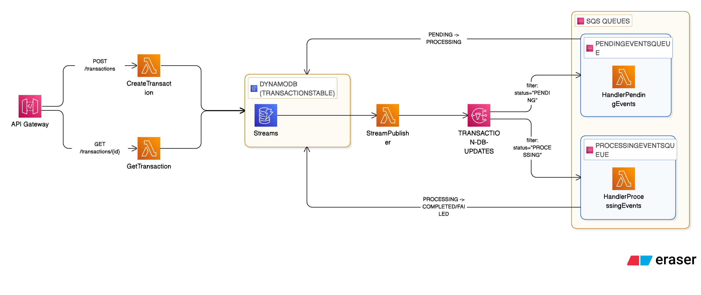

# Transaction Processing System

A serverless transaction processing system built with AWS SAM, TypeScript, and LocalStack. The system implements an event-driven architecture for asynchronous transaction lifecycle management.

## Table of Contents

- [Project Overview](#project-overview)
- [Architecture](#architecture)
- [Transaction Lifecycle](#transaction-lifecycle)
- [API Endpoints](#api-endpoints)
- [Local Development Setup](#local-development-setup)
- [Testing](#testing)
- [Design Considerations](#design-considerations)
- [Project Structure](#project-structure)
- [Future Improvements](#future-improvements)

---

## Project Overview

This project implements a transaction processing system that handles financial transactions through an asynchronous lifecycle. Transactions are created via a REST API and automatically progress through different states using an event-driven architecture.

---

## Architecture

The system uses an event-driven architecture with DynamoDB Streams, SNS fan-out, and SQS queues for reliable message processing.



### Architecture Components

| Component | Description |
|-----------|-------------|
| **API Gateway** | REST API for transaction operations |
| **CreateTransaction Lambda** | Creates transactions with PENDING status |
| **GetTransaction Lambda** | Retrieves transaction by ID |
| **DynamoDB** | Stores transactions with stream enabled |
| **StreamPublisher Lambda** | Reads DynamoDB streams and publishes to SNS |
| **SNS Topic** | Fan-out messaging with filter policies |
| **SQS Queues** | Reliable message delivery to Lambda handlers |
| **Lambda Handlers** | Process transaction state transitions |

---

## Transaction Lifecycle

Transactions progress through the following states:

```
┌─────────┐      ┌────────────┐      ┌───────────┐
│ PENDING │ ───▶ │ PROCESSING │ ───▶ │ COMPLETED │
└─────────┘      └────────────┘      └───────────┘
                       │
                       │
                       ▼
                 ┌──────────┐
                 │  FAILED  │
                 └──────────┘
```

### State Descriptions

| State | Description |
|-------|-------------|
| **PENDING** | Initial state when transaction is created |
| **PROCESSING** | Transaction is being processed by the system |
| **COMPLETED** | Transaction processed successfully (amount starts with even digit) |
| **FAILED** | Transaction processing failed (amount starts with odd digit) |

## API Endpoints

### Health Check

```http
GET /health
```

**Response:**
```json
{
  "ok": true
}
```

### Create Transaction

```http
POST /transactions
Content-Type: application/json
```

**Request Body:**
```json
{
  "amount": 100.00,
  "currency": "USD",
  "reference": "INV-001"
}
```

| Field | Type | Required | Description |
|-------|------|----------|-------------|
| `amount` | number | Yes | Transaction amount (must be positive) |
| `currency` | string | Yes | Currency code (e.g., "USD", "EUR") |
| `reference` | string | Yes | External reference identifier |

**Success Response (201 Created):**
```json
{
  "id": "f640d7fa-3c48-52bf-b3ac-74f71a1a9479",
  "reference": "INV-001",
  "amount": 100.00,
  "currency": "USD",
  "status": "PENDING",
  "createdAt": "2024-01-15T10:30:00.000Z",
  "updatedAt": "2024-01-15T10:30:00.000Z"
}
```

**Error Response (400 Bad Request):**
```json
{
  "error": "ValidationError",
  "details": [
    { "field": "amount", "message": "amount must be a positive number" }
  ]
}
```

**Error Response (409 Conflict):**
```json
{
  "error": "Conflict",
  "message": "Transaction already exists"
}
```

### Get Transaction

```http
GET /transactions/{id}
```

**Success Response (200 OK):**
```json
{
  "id": "f640d7fa-3c48-52bf-b3ac-74f71a1a9479",
  "reference": "INV-001",
  "amount": 100.00,
  "currency": "USD",
  "status": "COMPLETED",
  "createdAt": "2024-01-15T10:30:00.000Z",
  "updatedAt": "2024-01-15T10:30:05.000Z"
}
```

**Error Response (404 Not Found):**
```json
{
  "error": "NotFound",
  "message": "Transaction not found"
}
```

---

## Local Development Setup

### Prerequisites

- Docker
- Docker Compose

### Quick Start

1. **Install dependencies:**
   ```bash
   npm install
   ```

2. **Start LocalStack:**
   ```bash
   docker compose up -d localstack
   ```

3. **Deploy the stack:**
   ```bash
   docker compose run --rm deploy
   ```

4. **Verify deployment:**
   ```bash
   # The deploy script outputs the API base URL
   curl "$API_BASE/health"
   ```

### Example Usage

**Create a transaction:**
```bash
curl -X POST "$API_BASE/transactions" \
  -H "Content-Type: application/json" \
  -d '{"amount": 200, "currency": "USD", "reference": "INV-001"}'
```

**Retrieve a transaction:**
```bash
curl "$API_BASE/transactions/<transaction-id>"
```

### Tear Down

```bash
docker compose run --rm deploy ./scripts/destroy.sh
docker compose down
```

---

## Testing

Unit tests are implemented using Jest with TypeScript support.

### Run Tests

```bash
# Run all tests
npm test

# Run tests in Docker
docker compose run --rm deploy npm test
```

### Test Coverage

Tests cover:
- **CreateTransaction:** Input validation, DynamoDB operations, error handling
- **GetTransaction:** Retrieval, not found scenarios, error handling
- **StreamPublisher:** Event filtering, SNS publishing, batch processing
- **PendingEventsHandler:** Status transitions, idempotency, error handling
- **ProcessingEventsHandler:** Outcome determination, conditional updates

---

## Design Considerations

### Event-Driven Architecture

The system uses an event-driven approach for several benefits:
- **Loose coupling:** Components communicate via messages
- **Scalability:** Each component scales independently
- **Reliability:** SQS provides message persistence and retry

### Idempotent Transaction Creation

Transaction IDs are generated deterministically using the **required** `x-idempotency-key` header:

```typescript
const id = uuidv5(idempotencyKey, uuidv5.DNS);
```

This ensures:
- **Idempotent creation:** Same idempotency key always generates same ID
- **Duplicate prevention:** `ConditionExpression: "attribute_not_exists(id)"` prevents duplicates
- **Client control:** Clients must provide unique keys per transaction

### Idempotent Lambda Handlers

Lambda handlers use **conditional DynamoDB updates** to ensure idempotency:

```typescript
ConditionExpression: "#status = :expectedStatus"
```

This prevents:
- **Duplicate processing:** Same message processed multiple times
- **Infinite loops:** Status changes don't re-trigger the same worker

### SNS Fan-Out Pattern

SNS filter policies route messages to appropriate queues:
- `status = "PENDING"` → TransactionPendingEventsQueue
- `status = "PROCESSING"` → TransactionProcessingEventsQueue

This eliminates unnecessary Lambda invocations for irrelevant statuses.

### Least-Privilege IAM

Each Lambda has minimal required permissions:
- **CreateTransaction:** `dynamodb:PutItem`
- **GetTransaction:** `dynamodb:GetItem`
- **StreamPublisher:** `dynamodb:GetRecords`, `sns:Publish`
- **Workers:** `dynamodb:UpdateItem`

---

## Project Structure

```
backend-test/
├── src/
│   ├── shared.ts                          # Shared utilities, constants, clients
│   ├── createTransaction.ts               # POST /transactions handler
│   ├── getTransaction.ts                  # GET /transactions/{id} handler
│   ├── healthCheck.ts                     # GET /health handler
│   ├── streamPublisher.ts                 # DynamoDB Stream → SNS publisher
│   ├── handlerTransactionPendingEvents.ts # PENDING → PROCESSING worker
│   └── handlerTransactionProcessingEvents.ts # PROCESSING → COMPLETED/FAILED worker
├── tests/
│   ├── createTransaction.test.ts
│   ├── getTransaction.test.ts
│   ├── handlers.test.ts
│   ├── streamPublisher.test.ts
│   ├── handlerTransactionPendingEvents.test.ts
│   └── handlerTransactionProcessingEvents.test.ts
├── scripts/
│   ├── deploy.sh                          # Deployment script
│   └── destroy.sh                         # Teardown script
├── template.yaml                          # AWS SAM template
├── docker-compose.yml                     # LocalStack configuration
├── package.json
├── tsconfig.json
└── jest.config.js
```

### Key Files

| File | Description |
|------|-------------|
| `template.yaml` | AWS SAM infrastructure definition |
| `src/shared.ts` | Centralized constants, types, and AWS clients |
| `src/streamPublisher.ts` | Bridges DynamoDB Streams to SNS |
| `docker-compose.yml` | LocalStack and deployment container setup |

---

## Future Improvements

### EventBridge vs StreamPublisher

**EventBridge Pipes** was the initial choice for DynamoDB Streams to SNS integration due to:
- **No-code solution:** Fully managed service
- **Lower operational overhead:** No Lambda to maintain
- **Better performance:** Direct integration

**StreamPublisher Lambda** was implemented instead because:
- **LocalStack limitations:** EventBridge Pipes not available in free tier

### Dead-Letter Queues (DLQ)

Add DLQ for failed message processing:

### Observability

- **CloudWatch Metrics:** Track transaction throughput, latency, error rates
- **X-Ray Tracing:** End-to-end request tracing

### Retry Strategies

- Configure SQS visibility timeout based on processing time
- Implement exponential backoff for transient failures
- Add circuit breaker pattern for downstream dependencies
